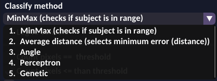
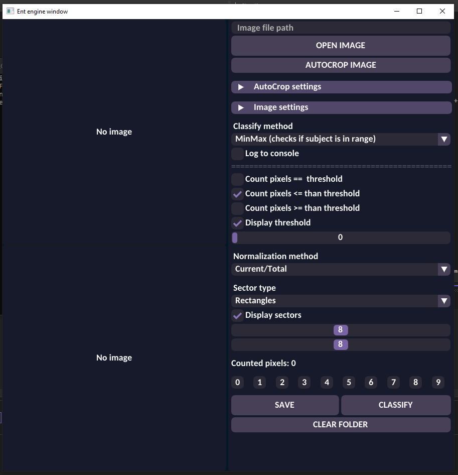
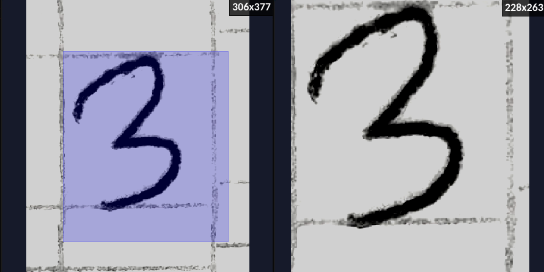
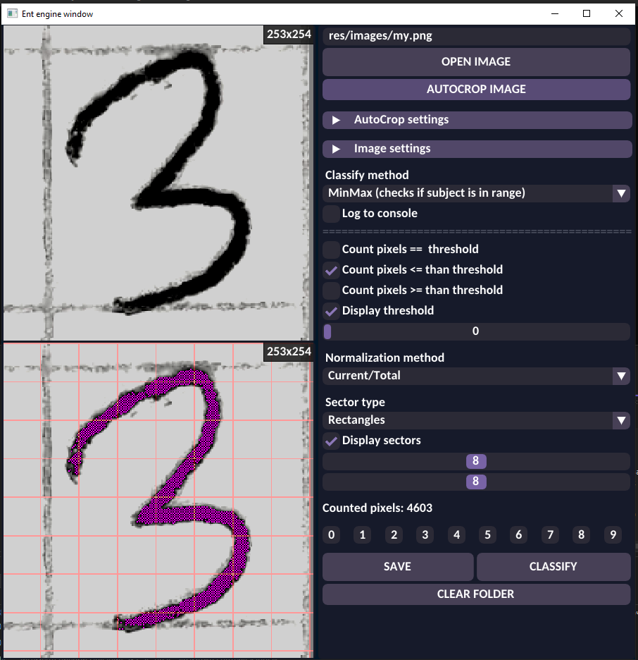
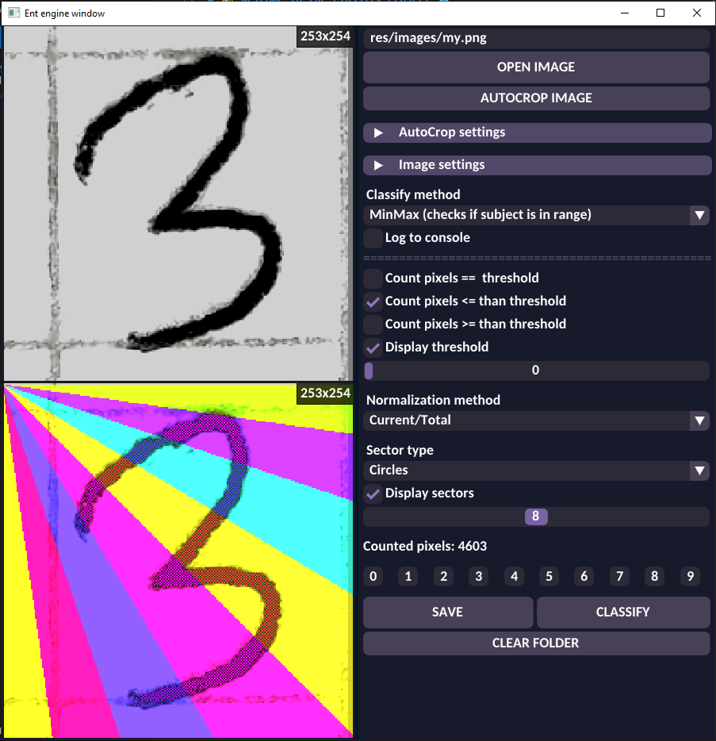
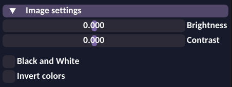
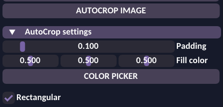
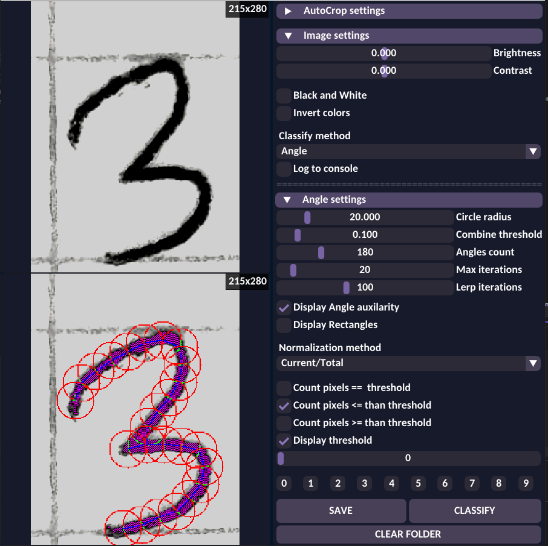
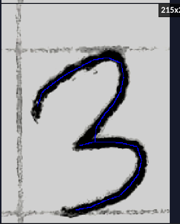
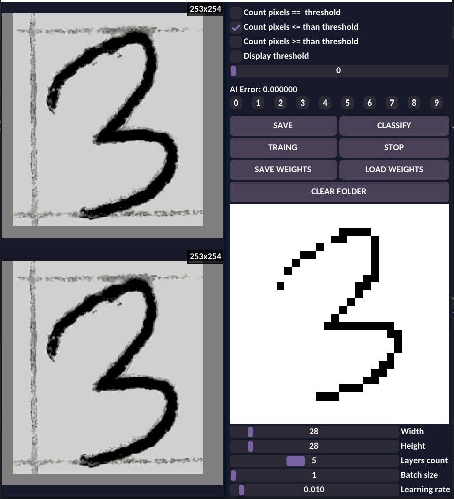

# 🖼️ Welcome to the Classify Project 🌐

This repository contains the source code for the Classify app. 

Classify allows to remember, recognize, and predict simple shapes such as numbers, etc. using different algorithms based on math or AI.

### There are 5 Classify methods:
- MinMax : divides image into smaller regions, counts pixels in each region based on mask configuration and uses this for predicting image class. If some region is in min-max range for target class, then probability of belonging to a particular class increases.
- Average distance : uses the same logic as MinMax, but is more accurate because it measures distance of current sector from average sector value.
- Angle : custom method that uses pathfinding algorithm to convert image number into combination of lines with angles. Angles are used for prediction (for example number 1 has mostly vertical lines).
- Perceptron : uses configurable multilayer perceptron neural network model for class prediction with backpropogation learning algorithm.
- Genectic (WIP) : uses the same neural network as Perceptron did, but learning method is genetic. 

### Program interface
Program consists of three parts:
- Top left rectangle: a region wich represents input image preview. You can drag for selecting desired image part and it would be croped.
- Bottom left rectangle: this region is a preview of different algorithm work, like masking layer, etc.
- Right rectangle: this part is the main menu which allows to do many things.

### Cropping image
Just click and drag for region selection. After left mouse button is released image will be cropped.

|

### MinMax and Average distance method
After loading image and cropping for example number 3 both MinMax and Average distance methods divides image into smaller regions and counts pixels that match mask (show with purple and black pixels). The smaller regions are shown with vertical and horizontal lines. Then you select any of available classes [0-9] that you believe your image belongs and click "save". You do this for some amount of images and classes. Then when you open a new "undefined" image you click "classify" to predict wich class is suitable for this image.

|

MinMax and Average distance algorithm have customizable secter dividing. You can make any combination of horizontal and vertical lines amount. Also there is a circular pattern which divides it in equal distance segments.

|

### Image editing
If you want to adjust brigthness, contrast, make it black and white and maybe invert colors - you can do this in this menu.

|

### Autocropping
For easier selection and better results it is recommended to use autocorp function. This function uses mask layer, then makes an equal padding and crops image. You can select the fill color, or use a color picker

|

### Angle method
This method uses custom logic for defining angle of an image and recursive call to complete the path. Later angles are converted to vertical horizontal diagonal_1 and diagonal_2 to make predictions.

|

|

### Perceptron method
As mentioned in the name, this method uses perceptron neural network for prediction. As usually you pick a dataset and train AI, after which you can predict undefined imaages. It is better to use Convolutional Neural Network (a simple modification of perceptron) but I had no time to implement this

|
